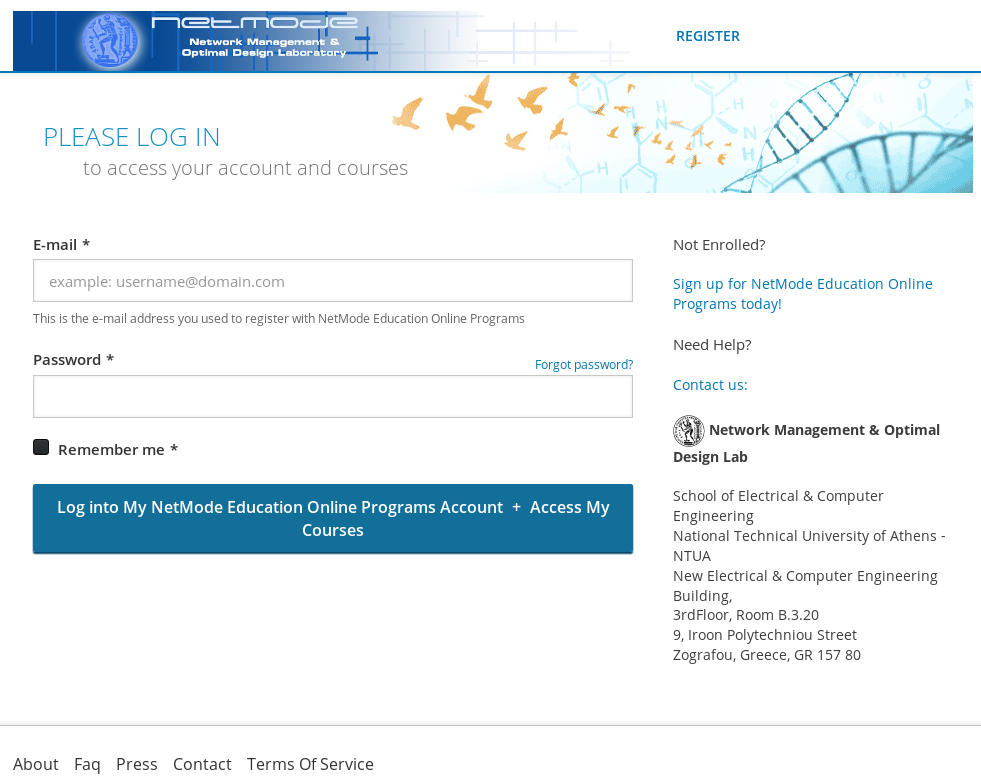
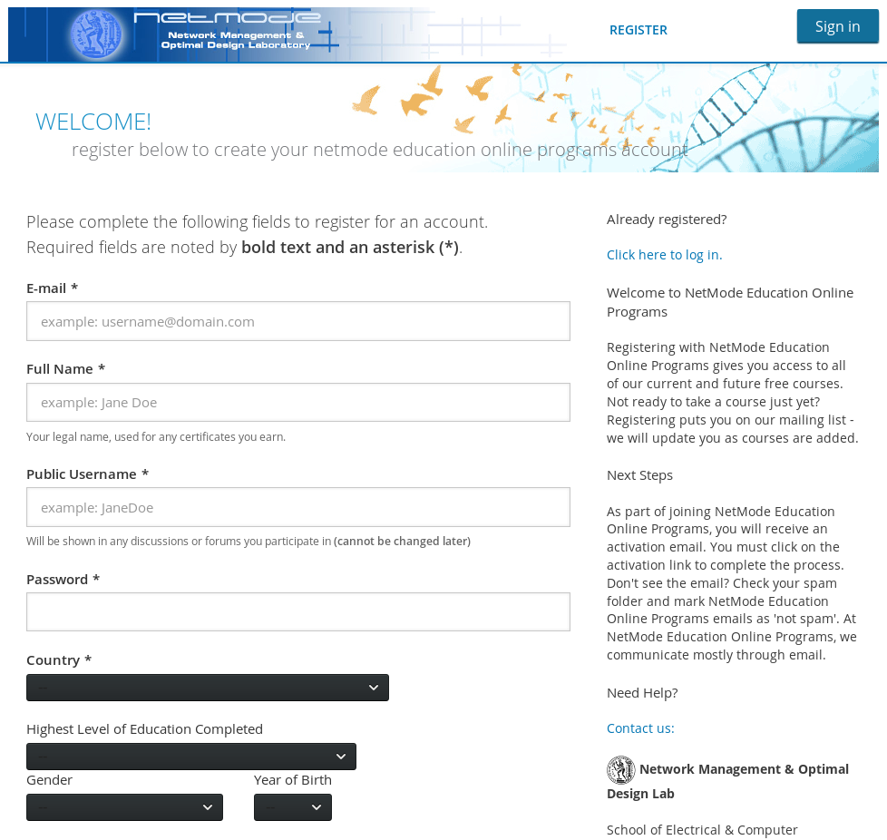
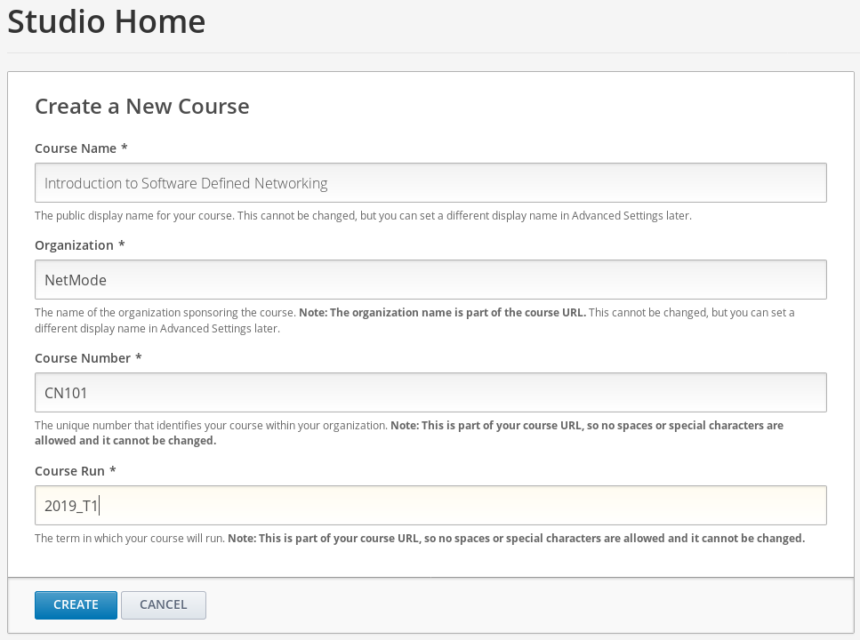
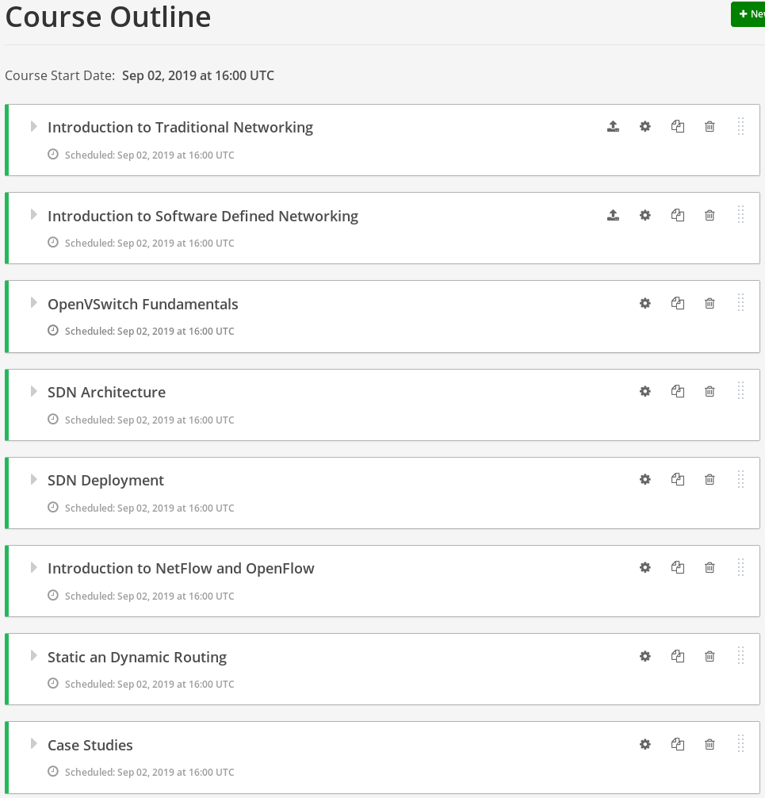
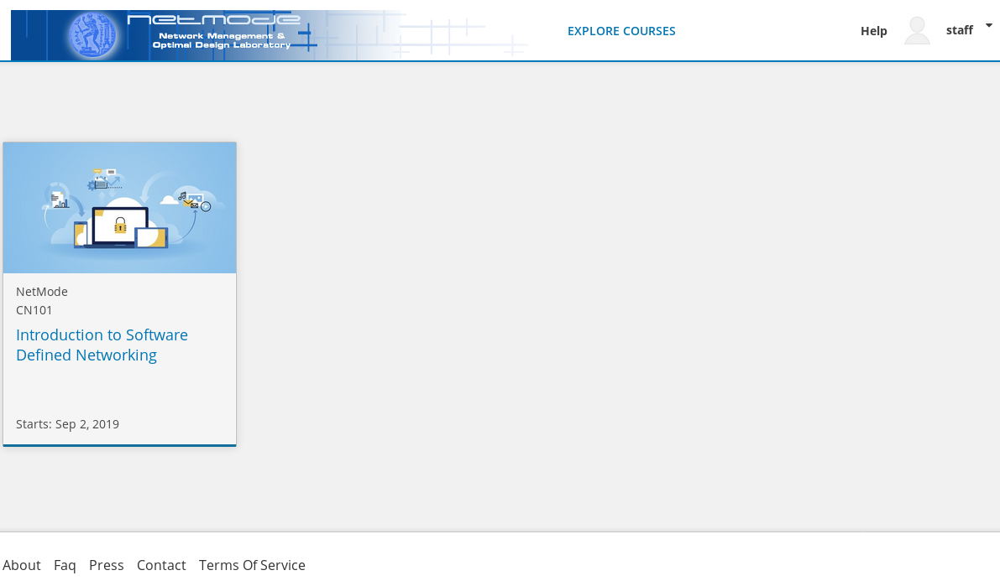
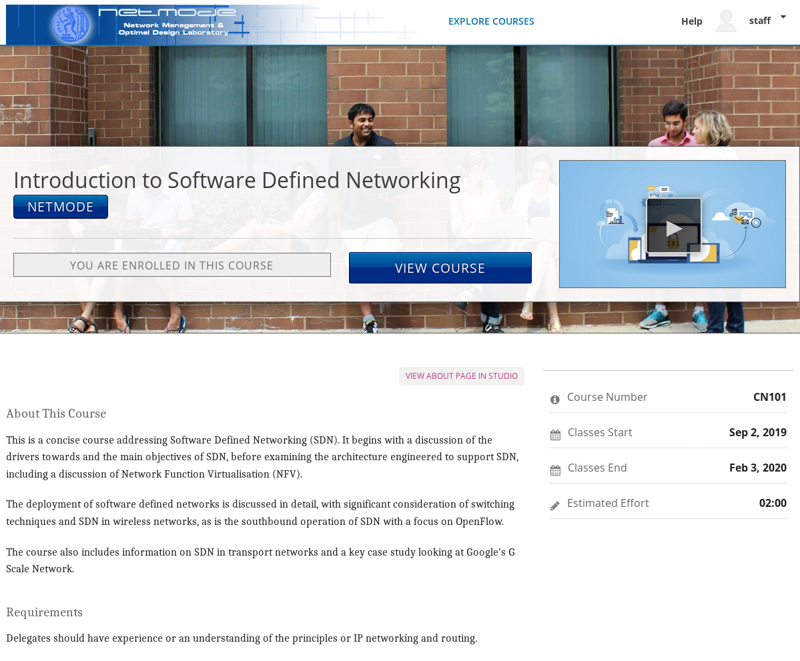
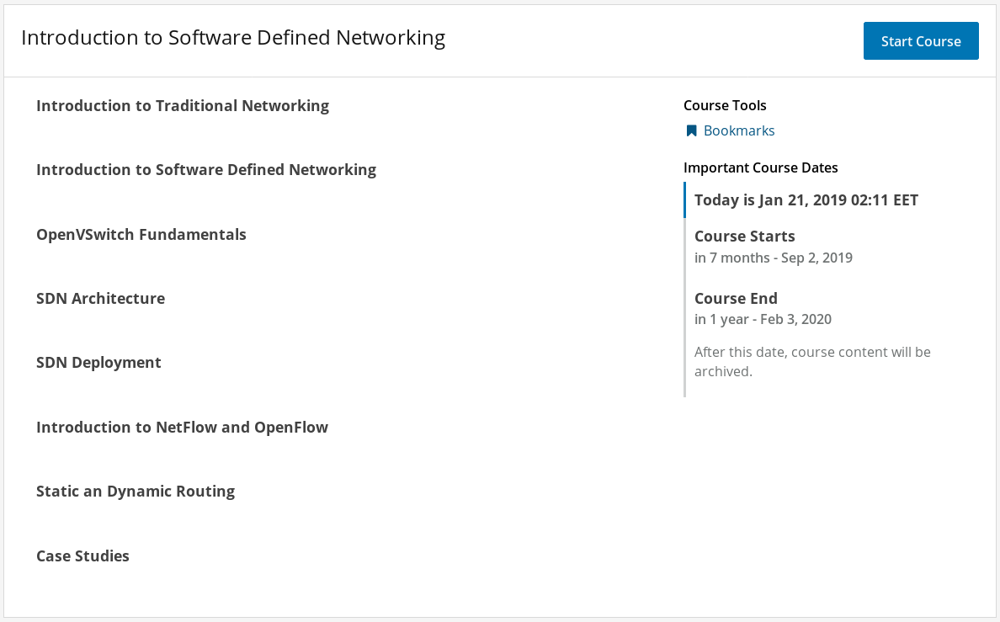

title: Πολυμεσικό Υλικό στο Ιντερνετ: Συγχρονισμός, Επεξεργασία και Διακίνηση
class: animation-fade
layout: true

<!-- This slide will serve as the base layout for all your slides -->
.bottom-bar[
  {{title}}
]

---

class: impact

## {{title}}
## &nbsp;
### Δημήτριος Πολίτης
### &nbsp;
#### Εθνικό Μετσόβιο Πολυτεχνείο
#### Σχολή Ηλεκτρολόγων Μηχανικών και Μηχανικών Η/Υ

---

## Ηλεκτρονική Μάθηση

### .primary[Εισαγωγή]

* Είναι η χρήση ηλεκτρονικών μέσων, εκπαιδευτικών τεχνολογιών αλλά και τεχνολογιών πληροφορίας και επικοινωνίας (ΤΠΕ) στην εκπαίδευση.

* Διακρίνεται επιμέρους στη Σύγχρονη και Ασύγχρονη μάθηση.

--

### .primary[Τύποι Ηλεκτρονικής Μάθησης]

* __Σύγχρονη Μάθηση.__ Ο όρος σύγχρονη μάθηση χρησιμοποιείται για να περιγράψει
μορφές μάθησης και διδασκαλίας που λαμβάνουν χώρα την ίδια χρονική στιγμή, αλλά όχι
στον ίδιο χώρο

* __Ασύγχρονη Μάθηση.__ Ο όρος Ασύγχρονη μάθηση χρησιμοποιείται για να περιγράψει μορφές μάθησης και διδασκαλίας που λαμβάνουν χώρα τόσο σε διαφορετικές τοποθεσίες όσο και σε διαφορετικό χρόνο.

---

## Πλατφόρμα Open edX

### .primary[Γενικά Στοιχεία]

* Το Open edX είναι το λογισμικό πλατφόρμας ανοιχτού κώδικα το οποίο παρέχει δυνατότητες εξ αποστάσεως εκπαίδευσης

--

Το λογισμικό Open edX αποτελείται από διάφορα επιμέρους τμήματα λογισμικού, το καθένα από τα οποία επιτελεί μια συγκεκριμένη εργασία. Τα κύρια μέρη του:

* __Σύστημα Διαχείρισης Μάθησης (LMS)__ Το LMS είναι η διεπαφή του λογισμικού Open edX.

--

* __Studio__ Το Studio είναι το περιβάλλον συγγραφής μαθημάτων. Οι εκπαιδευτές το χρησιμοποιούν για να δημιουργήσουν και να ενημερώσουν μαθήματα.

--

* __Django Administrator:__ Εργαλείο Διαχείρησης της Πλατφόρμας.

---

### .primary[Γενικά Στοιχεία]

Η πλατφόρμα Open edX παρέχει και άλλη λειτουργικότητα, η οποία αφορά σε:

* __Συζητήσεις - Forum:__ Η υπηρεσία αυτή περιλαμβάνει μια διαδικασία κοινοποίησης, που στέλνει ειδοποιήσεις στους εγγεγραμμένους μαθητές.

--

* __Ενσωμάτωση Λειτουργικότητας Φορητών Συσκευών__ περιλαμβάνει μια εφαρμογή για κινητά, διαθέσιμη για iOS και Android.

--

* __Analytics__ Γεγονότα τα οποία περιγράφουν την αλληλεπίδραση των μαθητών, συλλέγονται από το analytics framework του Open edX.

---

## Ανάλυση Διαδικασίας Κατασκευής του Ιστοτόπου

### .primary[Εργαλεία που χρησιμοποιήθηκαν]

Τα εργαλεία που χρησιμοποιήθηκαν για την ανάπτυξη του κώδικα:

* __Ansible:__ (Εργαλείο Αυτοματοποίησης - https://www.ansible.com)

* __Vagrant__ (Open Source VM Provissioner - https://www.vagrantup.com)

--

Εργαλεία Συστήματος:

* __Ubuntu 16.04__ (Open Source Operating System)

* __NginX__ (Open Source Web Server)

* __MariaDB__ (Open Source DB Server)

---

### .primary[Εργαλεία που χρησιμοποιήθηκαν]

Εργαλεία Τεκμηρίωσης:

* __Markdown / node.js / backslide__ (Open Source Presentation creation)

* __LaTeX__ (Open Source Documentation Preparation System)

--

Η τεκμηρίωση και τα αρχέια ρυθμίσεων είναι διαθέσιμα από τη διεύθυνση:
&nbsp;

https://github.com/dpolitis/open-edx-install.

---

### .primary[Διαδικασία Ανάπτυξης Ιστοτόπου]

* Αρχικά δημιουργήθηκε η υποδομή με τη χρήση του Vagrantfile, που παραμετροποιήθηκε για την αυτοματοποίηση της εγκατάστασης και ρύθμισης των εργαλείων συστήματος με την χρήση του αντίστοιχου bash script.

--

* Στη συνέχεια τοποθετήθηκε ο κώδικας του Open edX και ολοκληρώθηκε η εγκατάσταση με τη χρήση της ansible.

--

* Δημιουργήθηκαν δοκιμαστικοί χρήστες και δεδομένα για την διενέργεια αποσφαλμάτωσης.

--

* Κατασκευή MicroSite και ενδεικτικού μαθήματος.

--

&nbsp;

Στα επόμενα θα αναλυθούν οι κύριες λειτουργίες του ιστοτόπου.

---

## Επιγραμματική Περιγραφή Λειτουργίας

### .primary[Αρχική Σελίδα - Συνδεση]

Στην εικόνα φαίνεται η αρχική σελίδα σύνδεσης (login page):
&nbsp;

---

## Επιγραμματική Περιγραφή Λειτουργίας

### .primary[Διαχείρηση Χρηστών]

Στην εικόνα φαίνεται η σελίδα δημιουργίας χρηστών:
&nbsp;

---

## Επιγραμματική Περιγραφή Λειτουργίας

### .primary[Διαχείρηση Μαθημάτων]

Στην εικόνα φαίνεται η σελίδα δημιουργίας νέου μαθήματος:
&nbsp;

---

## Επιγραμματική Περιγραφή Λειτουργίας

### .primary[Διαχείρηση Μαθημάτων]

Στην εικόνα φαίνεται η σελίδα διαχείρησης διδακτικών ενοτήτων:
&nbsp;

---

## Επιγραμματική Περιγραφή Λειτουργίας

### .primary[Περιήγηση στον ιστότοπο]

Στην εικόνα φαίνεται η σελίδα του ιστοτόπου μετά τη δημιουργία του ενδεικτικού μαθήματος:
&nbsp;

---

## Επιγραμματική Περιγραφή Λειτουργίας

### .primary[Περιήγηση στον ιστότοπο]

Στην εικόνα φαίνεται η σελίδα επισκόπησης του μαθήματος:
&nbsp;

---

## Επιγραμματική Περιγραφή Λειτουργίας

### .primary[Περιήγηση στον ιστότοπο]

Στην εικόνα φαίνεται η σελίδα επισκόπησης των διδακτικών ενοτήτων του μαθήματος:
&nbsp;

---

## Επιγραμματική Περιγραφή Λειτουργίας

### .primary[Επίδειξη Λειτουργιών του ιστοτόπου]

&nbsp;

Είσοδος στο URL του ιστοτόπου και επίδειξη λειτουργιών.

---

## Ερωτήσεις ??

Επικοινωνία:
##### civisd (at) gmail (dot) com
##### https://github.com/dpolitis
##### https://www.linkedin.com/politisd